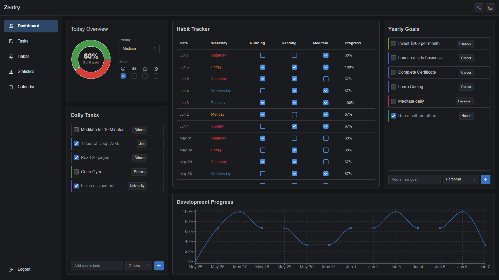

# 📝 Zentry - Personal Productivity & Goal Tracking Platform

A modern, full-stack application designed to help users track their tasks, habits, and goals with comprehensive progress monitoring and analytics.



## ✨ Core Features

### 📋 Task Management
- Daily task tracking with topic categorization
- Task prioritization system
- Completion status tracking
- Task editing and deletion
- Topic-based organization (University, Job, Fitness, Appointments, etc.)

### 🎯 Yearly Goals
- Long-term goal setting and tracking
- Goal categorization (Career, Education, Health, Personal, Finance)
- Progress monitoring
- Goal completion tracking
- Easy goal management interface

### ⚡ Habit Tracking
- Daily habit monitoring
- Streak tracking system
- Habit completion logging
- Customizable habit categories
- Progress visualization

### 📊 Analytics & Statistics
- Comprehensive task completion statistics
- Daily, weekly, and monthly progress views
- Visual progress charts and graphs
- Completion rate analytics
- Habit streak monitoring

### 🌟 Daily Mood Tracking
- Track daily emotional states
- Monitor productivity levels
- Track stress and energy levels
- Historical mood data analysis

### 💫 User Interface
- Modern, responsive design
- Dark/Light theme support
- Intuitive navigation
- Mobile-friendly layout
- Real-time updates

## 🛠️ Technical Stack

### 🎨 Frontend
- **Framework**: React 18 with TypeScript
- **Build Tool**: Vite
- **UI Library**: Mantine UI
- **Charts**: Recharts
- **Icons**: Tabler Icons
- **State Management**: React Context
- **Routing**: React Router
- **HTTP Client**: Axios
- **Development Tools**:
  - ESLint for code quality
  - TypeScript for type safety
  - SWC for fast compilation

### ⚙️ Backend
- **Runtime**: Node.js
- **Framework**: Express.js with TypeScript
- **Database**: Microsoft SQL Server
- **ORM**: Sequelize
- **Authentication**: JWT
- **API**: RESTful architecture

## 🚀 Setup Instructions

### 📋 Prerequisites
- Node.js (v18 or later)
- Microsoft SQL Server
- npm or yarn package manager
- Git

### 💾 Database Setup
1. Install Microsoft SQL Server
2. Create a new database named 'zentry'
3. Configure the database connection:
   ```bash
   # In server/.env
   DATABASE_URL="sqlserver://localhost:1433;database=zentry;user=sa;password=YourPassword;trustServerCertificate=true"
   ```

### 🔧 Backend Setup
1. Navigate to the server directory:
   ```bash
   cd server
   ```
2. Install dependencies:
   ```bash
   npm install
   ```
3. Set up environment variables:
   ```bash
   # Create .env file with:
   DATABASE_URL="your-database-url"
   PORT=3000
   NODE_ENV=development
   ```
4. Start the development server:
   ```bash
   npm run dev
   ```

### 🎨 Frontend Setup
1. Navigate to the client directory:
   ```bash
   cd client
   ```
2. Install dependencies:
   ```bash
   npm install
   ```
3. Start the development server:
   ```bash
   npm run dev
   ```

## 🔌 API Documentation

### 📋 Tasks Endpoints
- `GET /api/tasks/daily` - Get daily tasks
- `POST /api/tasks` - Create a new task
- `PUT /api/tasks/:id` - Update a task
- `DELETE /api/tasks/:id` - Delete a task

### 🎯 Goals Endpoints
- `GET /api/yearly-goals` - Get yearly goals
- `POST /api/yearly-goals` - Create a new goal
- `PUT /api/yearly-goals/:id` - Update a goal
- `DELETE /api/yearly-goals/:id` - Delete a goal

### ⚡ Habits Endpoints
- `GET /api/habits` - Get all habits
- `POST /api/habits` - Create a new habit
- `PUT /api/habits/:id` - Update a habit
- `DELETE /api/habits/:id` - Delete a habit
- `POST /api/habits/:id/log` - Log habit completion

### 📊 Statistics Endpoints
- `GET /api/stats` - Get user statistics
- `GET /api/stats/daily` - Get daily statistics
- `GET /api/stats/weekly` - Get weekly statistics
- `GET /api/stats/monthly` - Get monthly statistics

### 🌟 Mood Tracking Endpoints
- `GET /api/mood/daily` - Get daily mood
- `POST /api/mood` - Save mood data

## 👨‍💻 Development Guidelines

### 📝 Code Style
- Use TypeScript for all new code
- Follow ESLint configuration
- Use Prettier for code formatting
- Follow component-based architecture
- Implement proper error handling

### 🌿 Git Workflow
1. Create feature branches from main
2. Use meaningful commit messages
3. Submit pull requests for review
4. Maintain clean commit history

### ✅ Testing
- Write unit tests for critical functionality
- Perform manual testing before commits
- Test across different browsers
- Ensure mobile responsiveness

## 🤝 Contributing

1. Fork the repository
2. Create your feature branch (`git checkout -b feature/AmazingFeature`)
3. Commit your changes (`git commit -m 'Add some AmazingFeature'`)
4. Push to the branch (`git push origin feature/AmazingFeature`)
5. Open a Pull Request

## 📄 License

This project is licensed under the MIT License - see the LICENSE file for details.

## 👫 Authors
- Lennard Geißler